# Computer Vision Internship Report

This repository contains the projects completed as part of my Computer Vision internship. The internship was divided into two phases, each focusing on different aspects of image processing and computer vision. Below is a detailed breakdown of the first phase.

## Phase 1: Image Processing with OpenCV

In this phase, I focused on the fundamentals of image processing, learning to work with OpenCV in Python. The main topics covered were:

- **Image Input/Output**: Loading, saving, and displaying images.
- **Operations**: Blurring, drawing shapes, edge detection, and thresholding.
- **Color Spaces**: Conversion between color spaces like RGB, HSV, etc.
- **Contours**: Detecting and working with contours in images.

### Projects

1. [Age Detection](#age-detection)
2. [Color Detection](#color-detection)
3. [Face Anonymizer](#face-anonymizer)
4. [Text Detection](#text-detection)
5. [Tumor Detection](#tumor-detection)

### [Age Detection](https://github.com/inaijin/CV-Basics-Internship/tree/main/Phase1_Image_Processing/Projects/Age-Detection)

**Description**:  
In this project, I developed an age-detection system using the **age_net** model from OpenCV's deep learning module (cv2.dnn.readNet). The model predicts the age range of a person from an image, using pre-trained weights.

**Steps**:
- Load the **age_net** model.
- Perform face detection using OpenCV's cv2.CascadeClassifier.
- Apply the age model to the detected face regions to predict age.

**Results**:  
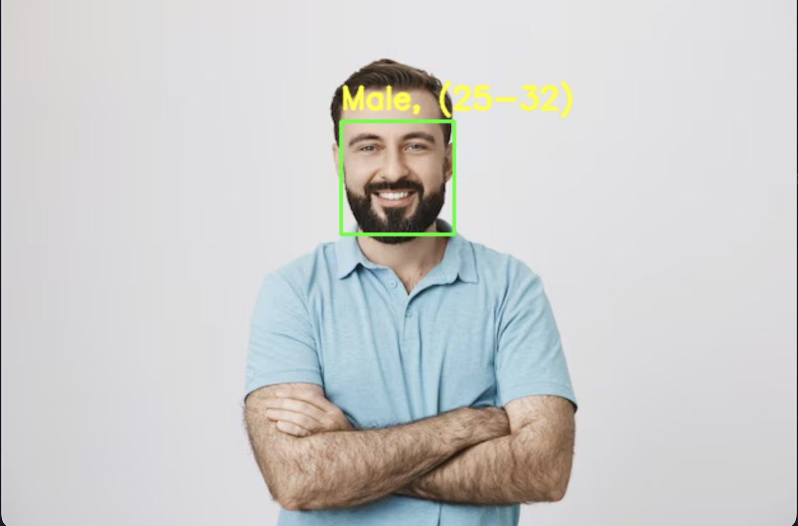

### [Color Detection](https://github.com/inaijin/CV-Basics-Internship/tree/main/Phase1_Image_Processing/Projects/Color-Detection)

**Description**:  
This project focused on detecting a specific color in an image by converting it to the **HSV color space**. A bounding box was drawn around the detected object to highlight the color.

**Steps**:
- Convert the image to the HSV color space using cv2.cvtColor().
- Use a color range mask to filter the target color.
- Draw a bounding box around the detected object.

**Results**:  
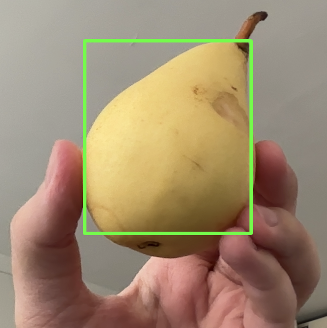

### [Face Anonymizer](https://github.com/inaijin/CV-Basics-Internship/tree/main/Phase1_Image_Processing/Projects/Face-Anonymizer)

**Description**:  
In this project, I implemented a face anonymization system where detected faces were blurred to hide identities. I used **MediaPipe's Face Detection** (faceDetectionMP.FaceDetection) for detecting faces.

**Steps**:
- Detect faces in the image using MediaPipe.
- Apply Gaussian blur to the detected face regions.

**Results**:  
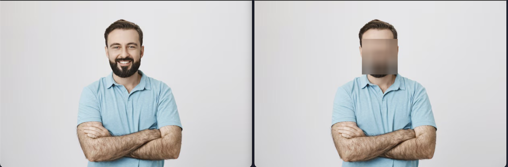

### [Text Detection](https://github.com/inaijin/CV-Basics-Internship/tree/main/Phase1_Image_Processing/Projects/Text-Detection)

**Description**:  
This project aimed at detecting text in images using the **easyOCR** library. The detected text was highlighted with bounding boxes, and the recognized characters were displayed.

**Steps**:
- Load the image and pass it through the easyOCR model.
- Draw bounding boxes around the detected text.
- Display the recognized text.

**Results**:  
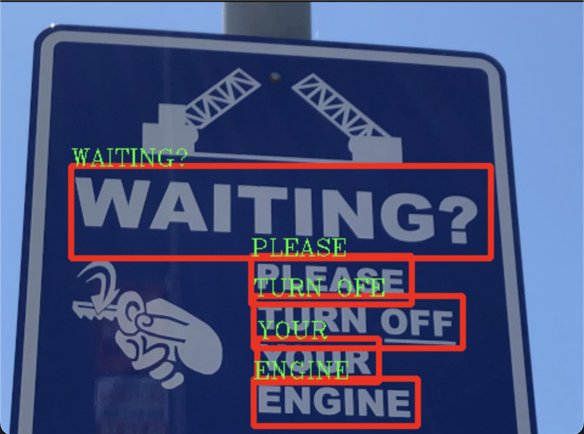

### [Tumor Detection](https://github.com/inaijin/CV-Basics-Internship/tree/main/Phase1_Image_Processing/Projects/Tumor-Detection)

**Description**:  
This project involved detecting tumors in brain scans using image processing techniques. The image was split in two, and differences between the two halves were used to locate the tumor. **Contours** and **thresholding** techniques helped in highlighting the tumor region.

**Steps**:
- Split the image into two halves.
- Compute differences between the halves to identify abnormalities.
- Use contour detection and thresholding to locate the tumor.

**Results**:  
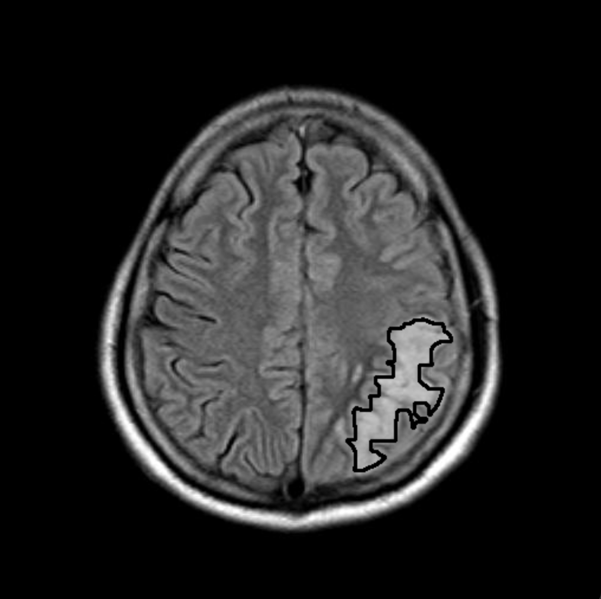

## Phase 2: Machine Learning

In this phase, the focus shifted to machine learning, where each topic was explored through practical, project-based learning. The projects were more advanced compared to Phase 1 and provided a deeper understanding of machine learning applications in computer vision.

### Topics Covered

1. [Image Classification](#image-classification)
2. [Object Detection](#object-detection)
3. [Pose Detection](#pose-detection)
4. [Semantic Segmentation](#semantic-segmentation)

### [Image Classification](https://github.com/inaijin/CV-Basics-Internship/tree/main/Phase2_ML/Image-Classification)

**Definition**:  
Image classification is the process of categorizing and labeling groups of pixels or vectors within an image based on specific rules. It is one of the key tasks in computer vision, used to identify objects, faces, scenes, and other visual data.

**Projects**:
1. **[Face Attendance](https://github.com/inaijin/CV-Basics-Internship/tree/main/Phase2_ML/Image-Classification/Face-Attendance)**:  
   In this project, we built a face attendance system using the **face_recognition** library and **Silent-Face-Anti-Spoofing**. The system recognizes faces, stores them in a database, and allows users to log in with their faces. To prevent spoofing (e.g., using a photo), the anti-spoofing system ensures that only real faces are accepted.  
   [Link to Silent-Face-Anti-Spoofing](https://github.com/minivision-ai/Silent-Face-Anti-Spoofing)
   
   **Results**:  
   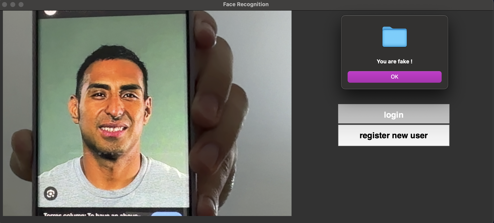

3. **[Parking Lot Detection](https://github.com/inaijin/CV-Basics-Internship/tree/main/Phase2_ML/Image-Classification/Parking-Lot)**:  
   This project involved training a machine learning model (Support Vector Machine - SVM) to classify parking spots as either **empty** or **occupied**. The model was trained using images of parking spots, and it was applied in real-time to detect the status of parking spots in a lot.

   **Results**:  
   

5. **[Weather Condition Detection](https://github.com/inaijin/CV-Basics-Internship/tree/main/Phase2_ML/Image-Classification/Wheather)**:  
   We used **YOLOv8** to train a classifier that detects weather conditions (e.g., rainy, sunny, cloudy). The classifier could distinguish between various weather conditions in real-time using pre-labeled weather data.
   
   **Results**:  
   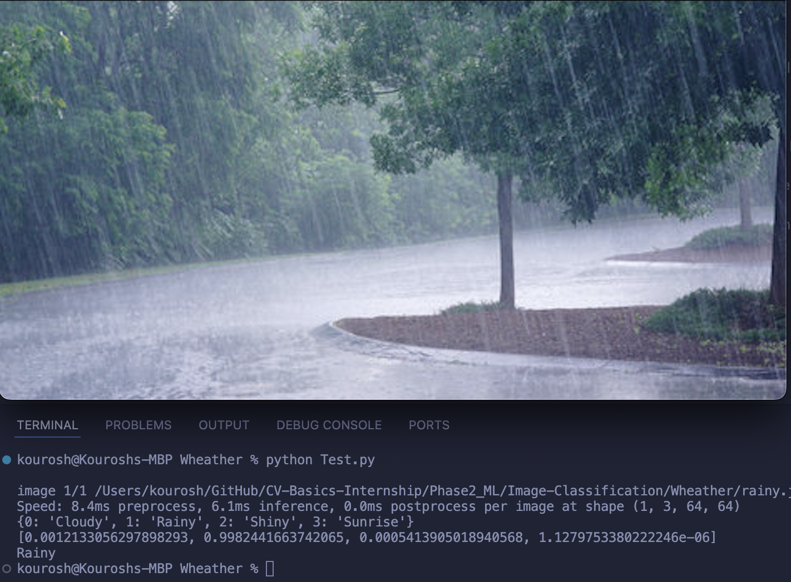

### [Object Detection](https://github.com/inaijin/CV-Basics-Internship/tree/main/Phase2_ML/Object-Detection)

**Definition**:  
Object detection is the task of detecting instances of objects of a certain class (like humans, cars, or animals) in images or videos. Unlike image classification, object detection provides both the class label and the localization (bounding box) of objects within the image.

**Project**:
- **[License Plate and Car Detection](https://github.com/inaijin/CV-Basics-Internship/tree/main/Phase2_ML/Object-Detection/Plate-Recognition)**:  
   In this project, we used **YOLOv8** to train an object detection model that could detect license plates. Pre-trained YOLOv8 models (coco) were used to detect cars, and Optical Character Recognition (OCR) was implemented to read the detected license plates in real-time from video footage.
  
   **Results**:  
   

### [Pose Detection](https://github.com/inaijin/CV-Basics-Internship/tree/main/Phase2_ML/Pose-Detection)

**Definition**:  
Pose detection is a computer vision technique used to estimate the positions of a person’s joints or body parts. It is widely used in applications such as gesture recognition, fitness monitoring, and sign language detection.

**Project**:
- **[Gesture Detection](https://github.com/inaijin/CV-Basics-Internship/tree/main/Phase2_ML/Pose-Detection/Sign-Detection)**:  
   We trained a pose detection model using **YOLOv8** to extract hand position data. Then, using a **Random Forest** machine learning model, we trained the system to recognize hand gestures. This system can be extended to detect sign language, but we used it for detecting simple gestures.
  
   **Results**:  
   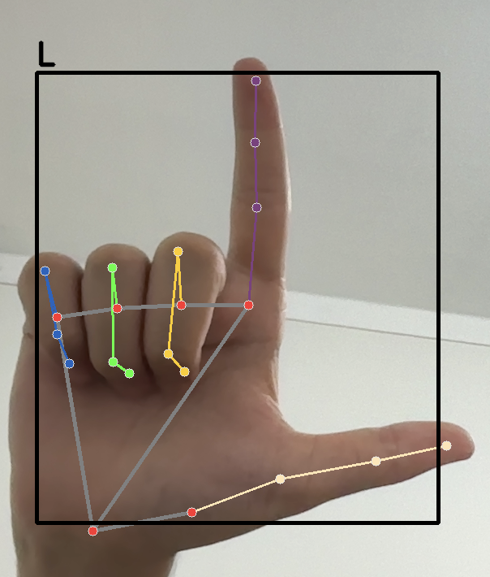

### [Semantic Segmentation](https://github.com/inaijin/CV-Basics-Internship/tree/main/Phase2_ML/Semantic-Segmentation)

**Definition**:  
Semantic segmentation is the process of partitioning an image into multiple segments (sets of pixels) where each pixel belongs to a specific class. Unlike object detection, which focuses on detecting objects with bounding boxes, semantic segmentation assigns a class label to each pixel, providing a more detailed understanding of the image.

**Project**:
- **[Food Segmentation](https://github.com/inaijin/CV-Basics-Internship/tree/main/Phase2_ML/Semantic-Segmentation/Food-Detection)**:  
   In this project, we trained a **YOLOv8 segmentation model** to detect and segment different types of food on a plate or dish. The model was able to identify different food items and segment them out for detailed analysis.
  
   **Results**:  
   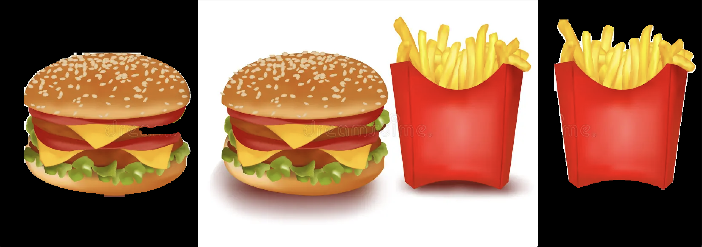

## Fun and Practical Projects

In addition to the structured projects, we also worked on some fun and practical projects that applied various machine learning techniques to real-world scenarios.

### 1. [Background Remover](https://github.com/inaijin/CV-Basics-Internship/tree/main/Phase2_ML/Projects/Background-Remover)

   **Description**:  
   This project used the **segment_anything** library to build a web application with **Streamlit** that removes the background from images. By allowing users to click on the part of the image they want to remove, the model improves accuracy and prevents unwanted elements from being considered as the background. This interaction made the background removal process more user-friendly and precise.

   **Results**:  
   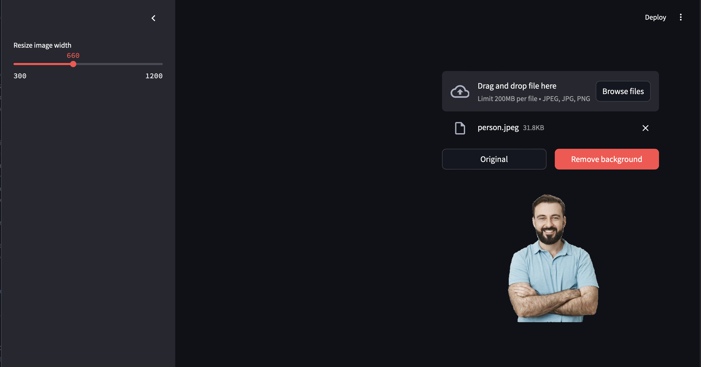

### 2. [Stable Diffusion / Dreambooth](https://github.com/inaijin/CV-Basics-Internship/tree/main/Phase2_ML/Projects/Dreambooth-Stable-Diffusion)

   **Description**:  
   In this project, we fine-tuned a **Stable Diffusion** model using **Dreambooth** with our own face, allowing us to generate creative and personalized images. The fine-tuning process was done both locally and via cloud services, offering flexibility. This project demonstrated how Dreambooth can be used to personalize image generation in a fun way.

   **Results**:  
   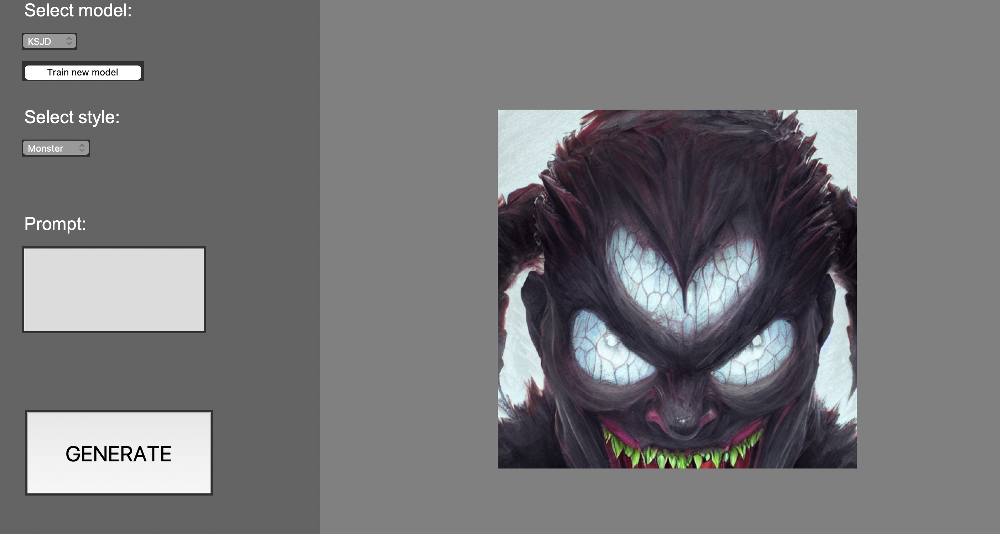

### 3. [Face Analyzer](https://github.com/inaijin/CV-Basics-Internship/tree/main/Phase2_ML/Projects/Face-Analysis)

   **Description**:  
   Using the **deepface** library, we built a face analysis web application that performed the following tasks:
   1. **Face Recognition**: Checks if the person in front of the camera matches the input image.
   2. **Similarity Check**: Measures how similar the person is to others in a database.
   3. **Facial Analysis**: Analyzes features like age, gender, race, etc., providing detailed information about the person’s face.

   **Results**:  
   

### 4. [Image Captioning](https://github.com/inaijin/CV-Basics-Internship/tree/main/Phase2_ML/Projects/Image-Captioning)

   **Description**:  
   This project involved using **Stable Diffusion** models to create a web app that generates captions for images. Initially developed using **Tkinter**, the project later transitioned to **Streamlit** for a more refined user experience. The model could describe the content of images and provide detailed captions, running locally for convenience.

   **Results**:  
   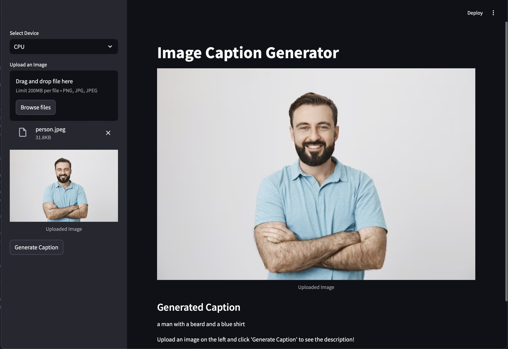

### 5. [Image Generation](https://github.com/inaijin/CV-Basics-Internship/tree/main/Phase2_ML/Projects/Image-Generation)

   **Description**:  
   We developed a local web application for AI-based image generation using **Stable Diffusion**. The app allows users to input specific prompts to generate high-quality images. This provides a free, local alternative to paid online services, although more precise prompts yield better results.

   **Results**:  
   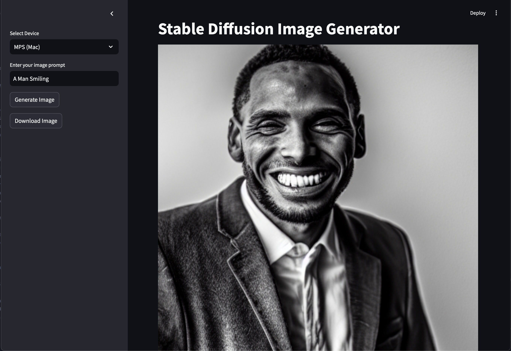

## Contributing
Feel free to fork this repository, open issues, or submit pull requests. Any contributions are welcome!
